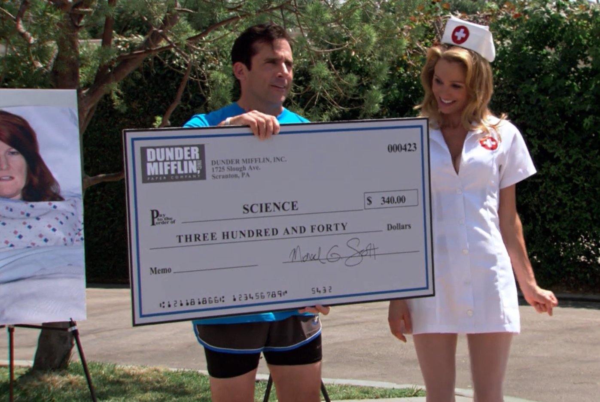

We had 8 crushed cans of Red Bulls, 4 packets of half-eaten chips, two pairs of drowsy red eyes and 8 hours left. I hadn’t slept in days and all we did was stare at our screens. This was our first hackathon at GE Healthcare’s JFWTC campus, Bengaluru.

For students, hackathons are like ice cream trucks — selling swag, goodies and a carnival ticket. They romanticize the world of code and silicon, glittering it with ridiculous dumps of food and cash. The effectiveness of such large scale hackathons to incubate innovation, which depend heavily on <a href="https://www.verywellmind.com/what-is-self-determination-theory-2795387" target="_blank">extrinsic factors of motivation</a> to attract students, can be debated. Or one could argue that the goal is not to innovate, but to rather encourage students to indulge in this field. Either way, we were sold on the idea. We were desperately looking for one and luckily fell upon GEHC’s precision challenge Hackathon. There was an ideation phase followed by a 24-hour on-site implementation challenge. We submitted our proposal within hours and were surprisingly amongst 36 teams all over India invited for the 24-hour coding sprint.

We made our very first _oopsy_ by going to the event with very little preparation, and It’s virtually impossible to complete a data science project with a front-end in a measly 24 hours. Nevertheless, we woke up that morning, barely showered and grabbed an Uber to JFWTC.

The place was ridiculous. They had this pantry setup with continental breakfast, a mini bakery _(nothing was mini about it smh)_, a juice bar and an ice bowl with a million Red Bulls just waiting to get you diabetic. After a small introductory session, we all got our workstations for the rest of the night.

 

<Text sx={{ fontSize: [1], width: ["100%"], textAlign: "center" }}>
  <i>4 hours in. I have no idea what we were talking about.</i>
</Text>

 

Things weren’t going well for us. Our idea was to build a dataset generator for dermatology clinics _(later expanded to general medical imagery datasets)_ which will remove any personal identifiers based on <a href="https://www.hipaajournal.com/hipaa-compliance-checklist/" target="_blank">HIPAA regulations</a>. In simpler terms, it was an electron app _(geez, I know)_ in which you dump medical images and it will clean them by removing identifiers like eyes, lips, textual information, etc while creating a parseable dataset for research purposes. But it was just the two of us, and we weren’t familiar with front-end very well. I managed to bootstrap together a cleaning engine by midnight and we started working on a presentable demo.

We had 8 hours left and we were trying to figure out how to dump our engine output in the app _(It’s ridiculously simple btw)_. After 2 hours of going through documentation and tutorials, I had given up on my dreams of holding a giant cheque like Michael Scott and took a nap, and boy was it a long nap. When I finally did wake up, my teammate had apparently figured out a solution _(which I didn't hear thanks, to my hearing loss. Damn you ATH-M50s)_ and went for his nap shift. I for one, still in the impression that we are screwed, started preparing for our pitch to the judges.

Fast forward to 9AM, we were actually done with our prototype and the pitch decks. There were multiple panels set up for screening all the 36 teams. We had to pitch our idea and present a live demo of the prototype to 3 judges in our panel, and we aced it. Once the screenings were over, we were asked to be seated in the main hall for the results. After toying around with us for an hour they finally started announcing the finalists, and when the emcee struggled pronouncing one of the team names, we knew we made it to the finals.

> _Our team name was GLaDOS.SHoDAN, a weird portmanteau of <a href="https://theportalwiki.com/wiki/GLaDOS" target="_blank">GLaDOS</a> aka **G**enetic **L**ifeform **a**nd **D**isk **O**perating **S**ystem, the infamous cynical AI from the Portal game series, which is the name I go by on various online platforms, and <a href="https://shodan.fandom.com/wiki/SHODAN" target="_blank">SHoDAN</a> aka **S**entient **H**yper-**o**ptimized **D**ata **A**ccess **N**etwork, another AI from System Shock game series, which was my teammate's choice. He just wanted to choose something cool._

For the finals, the top 5 teams had to compete in a shark tank style pitch to the audience and the panelists, which we weren't prepared for. I was in the impression that we were done, they'll give us something and call it a day. We went in pretty early for our pitch and did pretty ok, though we didn't get any questions, unlike others who were being grilled, and it's generally a good thing to get a lot of questions. The team who went after us pitched their solutions like onion vendors who had Masters in vegeculture. All my leftover "Michael Scott holding cheque" dreams were now gone. I went and sat in the corner in dismay for the rest of the event. But as it turned out, we _actually won_! 2nd runner up. Bagged 50K cash, an internship and got to hold the cheque! Apparently the two teams which didn't make it through hadn't thought of market feasibility and wide-scale adoption, and the onion vendors were one of em. SUCK IT.

 

<Text sx={{ fontSize: [1], width: ["100%"], textAlign: "center" }}>
  <i>You don't need to see our faces, we didn't bath for a week.</i>
</Text>

 

Hackathons are intimidating. I wouldn't have even thought about participating in one 2 years back. But to be honest, they aren't that hard to crack. Hackathons are all about the art of presentation. You need to sell your idea, not it's technical prowess. And once you figure that out, you'll be cashing in on giant cheques like hot cakes.

 

<Text sx={{ fontSize: [1], width: ["100%"], textAlign: "center" }}>
  <i>I love this episode.</i>
</Text>

 
