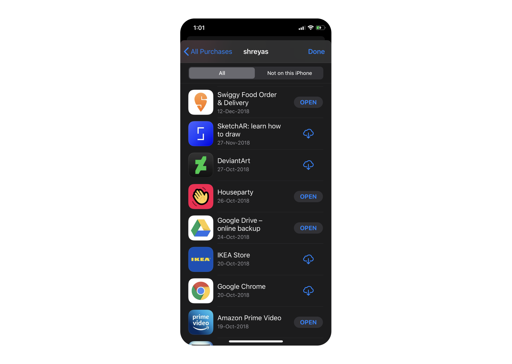

I was on my way down to the common mess at my uni when I read an email stating that our ongoing sports fest has been canceled and the uni is under lockdown. Things got chaotic pretty quickly after that. Students were hoarding the canteen in fear of scarcity and many were in a hurry to leave the campus. Luckily I was able to come back home via road amidst fear of <a href="https://www.nationalgeographic.com/science/2020/01/how-coronavirus-spreads-on-a-plane/" target="_blank">airborne transmission in flights</a>. 

The COVID-19 outbreak has wreck havoc in many countries, especially India, which will be in rubbles if community spread gets serious. A countrywide lockdown was initiated on 22nd March to contain the spread, which has been extended since then to April 14th. The following entries will go about my retrospective thoughts on the various changes that I have incorporated in my daily routine, updates on the outbreak and many more things.
 
 

##### Research work, hoardings and fake news.
8 hours into the lockdown and I'm already starting to feel claustrophobic. It's weird as I generally think going out is a chore, unless we're eating of course. For now we've stocked up of veggies and eggs but these youtube cooking vids are depleting our stock quickly. 

The lockdown is messing with my academic plans for the year. I'll have to resort to telephonic study for my research as participant observation is out of the picture. My plans to visit Sweden in August for my 20 credit project will probably get delayed too.

I don't understand why Indians like blowing things out of proportion. The man on the top asks us to clap, and we start performing Garba and have processions of men and women banging kitchen utensils while chanting "go corona, go". Meanwhile the virus is waiting outside our porch like John Travolta.

Panic shopping and grocery hoardings are going to cause a lot of problems. Grocery delivery services like Big Basket and Grofers have stopped showing delivery slots. I'm surprised that things didn't go down with these services like Instacart and Amazon, with their workers calling are demanding extended sick pay, health coverage and increased tip. 

 

##### 24th March, day 3
To ensure the safety of our maids, drivers and even our own, we have given them paid leave till the lockdown ends. This means we need to clean our own dishes, do laundry, clean the house and any other chore which you can think of. 2 days in and I can say it with confidence that we are heavily dependent on the so-called "unskilled" labor. Oh how the turntables. 

 

##### Houseparty, 25th March, day 4
Back in October 2018, I downloaded houseparty, a video chat app which is very similar to Snapchat in terms of design, in other words, pathetic. Obviously I deleted it, like I did to <a href="https://techcrunch.com/2017/11/19/ello-again/" target="_blank">Ello</a>,<a href="https://www.theverge.com/2019/8/26/20833903/facebook-instagram-threads-messaging-app-close-friends-snapchat" target="_blank"> Threads</a> by Instagram and devrant. Today morning I saw a couple of instagram stories of groups of friends playing pictionary in a video chat. 

 

##### Until tomorrow, 

 

##### Fake news, Dalgon coffee and the Houseparty scam, 31st March
Can we talk about how ridiculously fast information is spreading during this crisis? Lot of discussions opened online in the last two years about fake news and misinformation but I always looked past it until now. Whatsapp has emerged as de facto standard for sowing the seeds of a fake piece of information, and I'll show you how with 2 incidents which happened this week. 

I woke up today morning to my mom screaming on the phone, "Are you serious? She's positive? oh my god!". One of my mom's friends heard about a positive case in the apartment and immediately shared it with everyone. My mom immediately called up the family, who were confused as the kid was totally fine.  

I live in Film Nagar, a relatively lavish locality with quite a few places to hang out. We had 6 international students in our apartments who came back from their unis overseas, and were under quarantine as per government regulations. They had daily checkups done by GHMC officials who had also put up posters to notify everyone in the apartment/vicinity about these students who have travel history. It's a common protocol being followed in many countries right now. Turns out someone had mass forwarded messages on Whatsapp that our apartment had 6 positive cases and was locked down. Along with it was an image of a metal gate with a huge "Quarantined red zone" banner which wasn't even our gate, and images of the GHMC posters of each student. 

My whatsapp inbox blew up by evening. Mom and Dad had to answer around 100 calls and explain how the whole thing is an hoax. There were a few local news websites who were posting about it. It just took around 12 hours for that forwarded message to fool hundreds of families and 

I realise how powerful Whatsapp is as an incubator for fake news, with my parents discussing various conspiracy theories circulating in different groups. 

