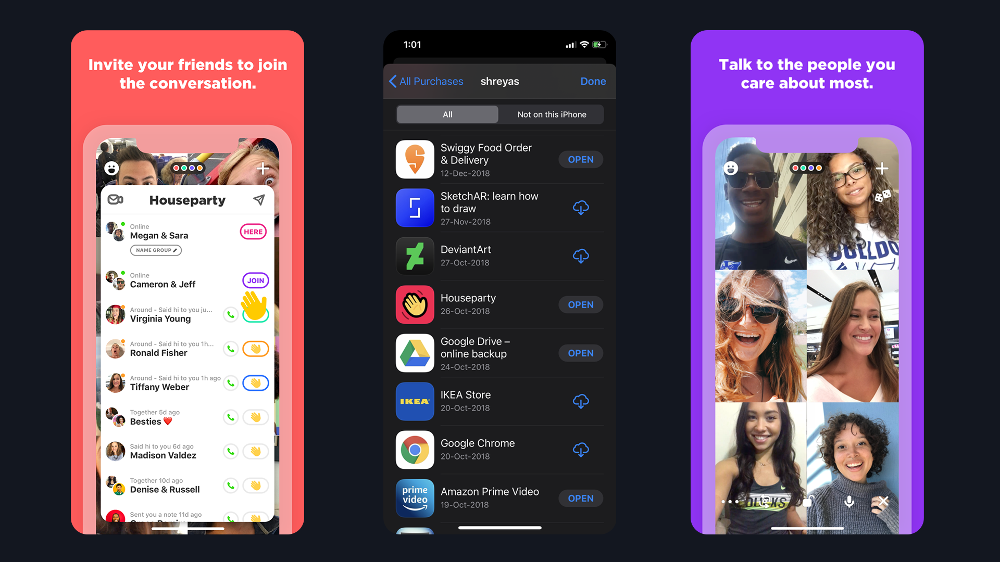
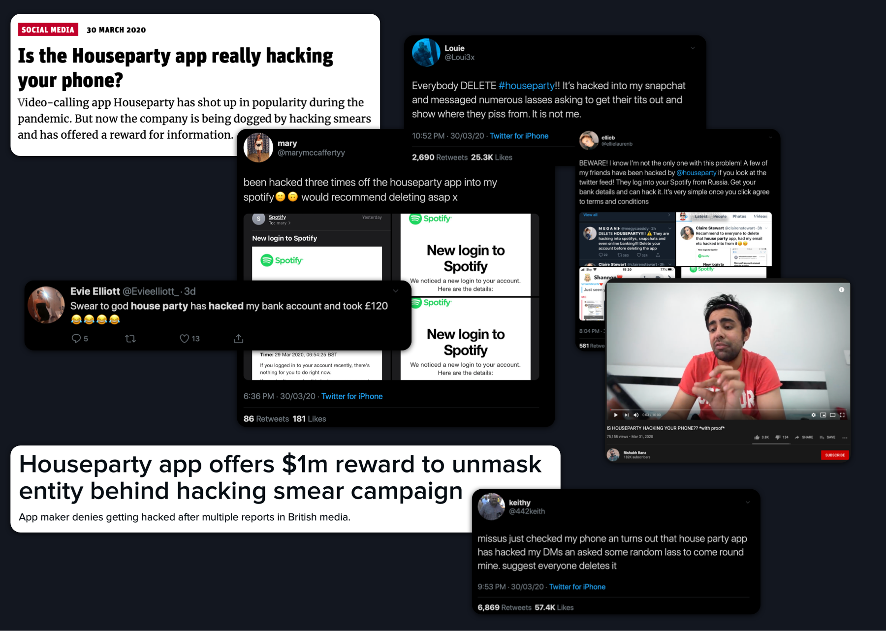
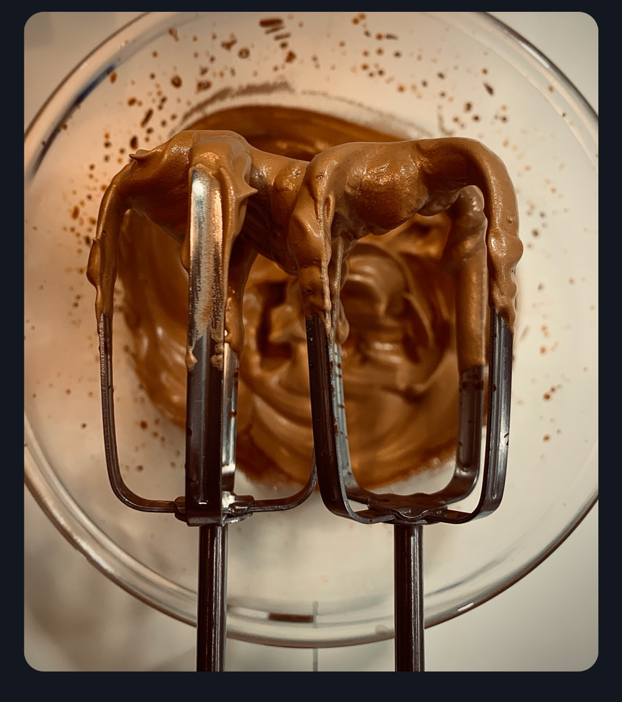
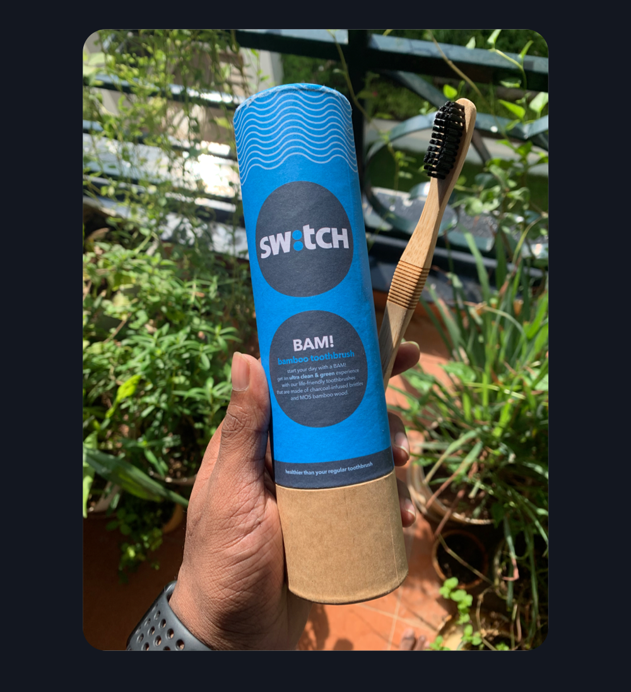

<Text sx={{ fontSize: [1], width: ["100%"], textAlign: "center" }}>
  <i>
    Photo by{" "}
    <a href="https://unsplash.com/@visuals" target="_blank" rel="noopener">
      visuals
    </a>{" "}
    on{" "}
    <a href="https://unsplash.com" target="_blank" rel="noopener">
      Unsplash
    </a>
  </i>
</Text>

 

I was on my way down to the common mess at my uni when I read an email stating that our ongoing sports fest has been canceled and the uni is under lockdown. Things got chaotic pretty quickly after that. Students were hoarding the canteen in fear of scarcity and many were in a hurry to leave the campus. Luckily I was able to come back home via road amidst fear of <a href="https://www.nationalgeographic.com/science/2020/01/how-coronavirus-spreads-on-a-plane/" target="_blank" rel="noopener">airborne transmission in flights</a>.

The COVID-19 outbreak has wreck havoc in many countries, especially India, which will be in rubbles if community spread gets serious. A countrywide lockdown was initiated on 22nd March to contain the spread, which has been extended since then to April 14th. The following entries will go about my retrospective thoughts on the various changes that I have incorporated in my daily routine, my observations, updates on the outbreak, and many more things.

 
 

#### The bartan dance

##### 22nd March, day 1

8 hours into the lockdown and I'm already starting to feel claustrophobic. That's weird, as I generally think going out is a chore, unless we're eating of course. For now, we've stocked up on veggies and stuff but these youtube cooking vids are depleting our stock pretty quickly. I've had around 80 eggs in the last 5 days. I'm basically panic eating.

Also, can someone explain me why Indians like blowing things out of proportion? The old man on top asks us to clap, and we start performing Garba and have processions of men and women banging kitchen utensils while chanting "go corona, go". Meanwhile, the virus is waiting outside our porch like John Travolta.

 
 

#### Housekeeping

##### 24th March, day 3

To ensure the safety of our maids, drivers and even our own, we have given them paid leave. This means we need to clean the dishes, do laundry, clean the house and any other chore which you can think of. 2 days in and I can say it with confidence that we are heavily dependent on the so-called "unskilled" labor. I don't understand how our maids aren't ripped to the core. I never knew mopping and dish washing were so energy intensive. Is there a household work skill on Linkedin? If so, stop right there and go +1 me.

Also, with all this household work, It's ridiculous that people expect us to be at our 100% productivity levels. It's a freaking pandemic guys, not a productivity contest. Please stop posting pics of your day planners.

 
 

#### Houseparty

##### 25th March, day 4

Back in October 2018, I downloaded houseparty, a video chat app which is very similar to Snapchat in terms of design. In other words, pathetic. Obviously I deleted it, like I did to <a href="https://techcrunch.com/2017/11/19/ello-again/" target="_blank" rel="noopener">Ello</a> and <a href="https://www.theverge.com/2019/8/26/20833903/facebook-instagram-threads-messaging-app-close-friends-snapchat" target="_blank" rel="noopener"> Threads</a> by Instagram. 2 years later, I see insta stories of my friends playing Pictionary in a video chat. That freakin' app was back.

Houseparty was woken out of dormancy by kids who've been bored to death amidst the pandemic. The app has peaked the App Store charts in just weeks, surpassing veteran apps like Whatsapp and Instagram who've stayed on top for a long time now. It's a video calling app with a twist, where you create chat rooms every time you video call someone, and these chat rooms can be open for either of the participant's friends to join, or closed for couples to do nasty stuff. It has like 4 games, which will seem boring couple of hours into the app. But what's awesome is the fact that I can enter random open rooms, make weird noises, and leave. The lockdown is fun again.

<Text sx={{ fontSize: [1], width: ["100%"], textAlign: "center" }}>
  <i>I did download it way back.</i>
</Text>

 
 

#### Fake news and the Houseparty scam

##### 31st March, day 10

Can we talk about how fast information is spreading during this crisis? A lot of discussions opened up online in the last two years about fake news and misinformation but I always overlooked them until now. Whatsapp has emerged as the de facto platform for sowing the seeds of misinformation, and I'll show you how with 2 incidents which happened this week.

I woke up today, only to see my mom screaming on the phone, "Are you serious? She's positive? oh my god!". One of her friends heard about a positive case in the apartment and immediately shared it with everyone. My mom called up the family, who were confused as they had no idea what the hell this lady was blabbering about.

We had 6 international travelers in our apartment who returned around a week back and were under quarantine as per government regulations. They had daily checkups done by GHMC officials who had also put up posters to notify everyone in the apartment/vicinity about people who had travel history, which is a common protocol being followed in many countries right now. Turns out someone had mass forwarded messages on Whatsapp that our apartment had 6 "positive" cases and was locked down. Along with it was an image of a metal gate with a huge "Quarantined red zone" banner which wasn't even our gate, and images of the GHMC posters for each traveler.

<Text sx={{ fontSize: [1], width: ["100%"], textAlign: "center" }}>
  <i>Do they even know what a red zone is?</i>
</Text>

 
 

My Whatsapp inbox blew up by evening. Mom and Dad had to answer around 150 calls and explain how the whole thing is a hoax. There were a few local news websites who were posting about it _(I'm not gonna give them ad revenue by providing a link here)_. It just took around 12 hours for that message to fool hundreds of families and become a nightmare for the travelers.

That was just the beginning. Ever since Houseparty went viral and I discovered <a href="https://snapcamera.snapchat.com" target="_blank" rel="noopener">Snapcamera</a>, I was spending a lot of time entering random open rooms and spooking people. The app basically brings all the snapchat community filters to the PC and Mac, where you can augment your video with filters on any video calling platform. Almost all my friends used to come online at around 11PM, and I did random stuff in different rooms till bedtime. Life was good, till some jackass decided to start a internet hoax.

<Text sx={{ fontSize: [1], width: ["100%"], textAlign: "center" }}>
  <i>What the hell, internet?</i>
</Text>

 

One of my pals texted me this morning about how the Houseparty app has been snooping on our social media and bank account credentials. Turns out, many had observed unsolicited bank transactions, random login attempts on Spotify and Twitter, unauthorised access to Instagram feed... you get the point. Now I am no security researcher, but this whole thing is bogus. Random bank transactions cannot happen as your card details are hidden behind either your Face ID or fingerprint authorisation, unless there is a security bug in iOS and android, which would mean all the apps on your phone are vulnerable. Random logins cannot happen unless you've reused your passwords everywhere and there is a security breach, which means all your accounts are compromised.

This was horrible. Within hours, everyone I knew left the app. No fact checking, no verifying the legitimacy of the various claims made by that school friend of your sister's boyfriend, NOTHING. It's cause of you numbnuts that my night routine is now dead. Go download the freakin' app and let me barge in your open rooms like a smiling potato and pickle shrey!

 
 

#### The curious case of whipped coffee

##### 1st april, day 11

In today's episode of "Another viral TikTok", let's look at the internet sensation which made people without hand blenders, whip coffee, sugar and water with a freakin' spoon.
**_"Dalgona Coffee"_**. If you're a millennial like me, you might have already tried your hands at making this, but let me tell you something, I hate this concept. For starters, we need to acknowledge that this is yet another <a href="https://time.com/4789145/avocado-latte-australia/" target="_blank" rel="noopener">latte in avocado</a> bullshit by the kids on insta. It's the aesthetics and the process which makes it elegant, not the dish itself. The creamy sweet coffee froth looks cute floating on top of the milk and ice slurry, only till you're done posting a story on insta and sending 80 snaps. I have no clue how people managed to get the coffee to mix with the milk as the low-density froth is extremely adamant about socializing with anything! After battling my mason jar with a spoon for 15 minutes, I threw everything in a blender, something I would've done in the first place if it wasn't for the curse of attention.

 

#### Self haircut

##### 3rd April, day 13

I woke up today at around 2AM for my usual peeing routine, looked at myself in the mirror and decided, "aight imma give myself a haircut". A little cut here, a small trim on the sides, some finishing touches on the back and finally! I went bald. Whoever tweeted it said it right, We're going to see a lot of bad haircuts after the lockdown is over.

 
 

#### The dishwashing miscalculation

##### 11rd April, day 21

I've been washing dishes for a while now. So much that I was genuinely excited when mom allowed me to open a new dishwashing bar and I found a brand new scrubber in it. The skin on my left hand has started to peel, a condition called as Xeroderma, which can be caused due to dishwashing liquid. This was so problematic that I had to go on the internet and found this interesting <a href="https://www.cookingforbusymums.com/washing-dishes-gives-me-dermatitis-find-out-which-dish-soap-didnt-irritate-my-hands/" target="_blank" rel="noopener">blog article</a> which illustrates the effects of dishwashing soap ingredients on your skin. It's hard to go dishwashing soap shopping right now, but I'm using a hand moisturiser for the time being. But something interesting happened. I was always under the impression that the dishwashing machine at home was broken, till my brother mentioned that it was probably mom who didn't turn turn on the water supply. We tried it out and it worked! I've been cleaning dishes for 3 weeks for no damn reason!

 
 

#### Sweating that quarantine sweat

##### 12rd April, day 22

The whole lockdown had me thinking that this might be my chance to get back on track with a proper diet and workout, and I did. I've started cycling in our parking lot, which has an infinity-shaped, two-storey track of about 1.6 KMs. At 8 rounds that comes to around 13 KMs each day, which I'm a lil proud of. For the workouts, I'm using an app called <a href="https://liftinapp.co" target="_blank" rel="noopener">Liftin'</a>, which I downloaded way back in a <a href="https://www.reddit.com/r/apple/" target="_blank" rel="noopener">r/apple</a> promo saturday giveaway but never got to use it. It let's you create custom workout sessions with different sets and reps, keep track of progress, and has an Apple Watch companion app for tracking your vitals. This has become my personal mantra for closing all my rings.

 

#### The Levantine spread

##### 24th April, day 34

Last December We went to Dubai to celebrate my dad's 50th birthday with my uncle, and it was great! Though this was our second visit, there were a lot of things we missed back in 2014, and we covered a new ground, **food**! Levantine or Lebanese cuisine is quite the staple in Dubai, with popular joints like Al Mallah and Manoushe street which attract tourists curious about Arabic food. I had a curated list of eateries, bakeries, restaurants, and cafes from various credible sources like Mark Weins which I wanted to eat at, and was successful in covering a lot of ground. From Moutabel and Manakeesh to Luqaimat, it was something new every day. I fell in love with Mediterranean food and wished I can stay there forever.

<!--

<Text sx={{ fontSize: [1], width: ["100%"], textAlign: "center" }}>
  <i>
    Some snaps from the trip. Clockwise from top-left: Mezze Platter at{" "}
    <a href="https://www.walnutgrove.ae" target="_blank" rel="noopener">
      Walnut Grove
    </a>
    , Peshwari chicken at <a
      href="https://www.tripadvisor.in/Restaurant_Review-g295424-d817364-Reviews-Ravi_s-Dubai_Emirate_of_Dubai.html"
      target="_blank"
      rel="noopener"
    >
      Ravi Restaurant
    </a>, Manakeesh and Moutabel at <a
      href="https://almallahuae.com"
      target="_blank"
      rel="noopener"
    >
      Al Mallah
    </a>, Manakeesh at <a
      href="https://www.manoushestreet.com"
      target="_blank"
      rel="noopener"
    >
      Manoushe Street
    </a>, Luqaimat at <a
      href="https://www.alfanarrestaurant.com"
      target="_blank"
      rel="noopener"
    >
      Al Fanar
    </a>.
  </i>
</Text>

  -->

Well, little did I know that while I was gobbling food in the desert, something insidious was spreading in the wet markets of Wuhan. Sigh. Anyways, the lockdown had me cooking food which I've wanted to for so long and it had me thinking, what if I make a Levantine platter, and I did!

So the whole family got down to make two different styles of Hummus, Moutabel, some Semolina as we couldn't make Pita bread and Tabbouleh. Feast your eyes.

Oh btw, **Ramadan Mubarak**!

<Text sx={{ fontSize: [1], width: ["100%"], textAlign: "center" }}>
  <i>
    Clockwise from top-left: Moutabel, Tabbouleh, Semolina, piri-piri hummus and
    regular hummus
  </i>
</Text>

 

#### I got married!

##### 29th April, day 39

Last summer while interning for GE Healthcare, I started playing <a href="https://www.stardewvalley.net" target="_blank" rel="noopener">Stardew Valley</a> during nights as a stress buster from all the traveling. It's a country life simulator where you inherit your grandfather's farm after he passes away. There are a variety of things which you can do, seasonal farming, mining for minerals and ores, socialize with people, raise animals... it's a huge list, to be honest. Many people find it funny, but there is something about listening to country music while fishing by the lake and collecting rare fish. It's serene and blissful.

It's been a year since I started playing, year 3 spring to be precise, and I'm married! I've been dating Leah for almost 3 seasons and she is great! She's an artist who left the city in hopes of living an independent life and focus on her art and sculpting. 3 seasons might be too fast, but it's good to see her every day in my farm, working on her sculptures :)

Oh, did I mention my character is a girl?

 
 

#### The Fundraiser

##### 2nd May, day 42

We had a fundraiser at our community! I wasn't aware of the fundraiser being organised as discussions happened over the community Whatsapp group which I insisted to be not a part of. We had kids who had made these amazing cookies, brownies, cupcakes... even Starwars merch! I also had one of the best brownies of my life today!

 
 

#### Haleem comeback

##### 3rd May, day 43

Back when the uni shutdown was declared, I was in the impression that I'd go back home, go for my routine summer shopping, have some Mandi Biryani and be back in two weeks.

That aged like milk _eh_?

Anyways I was still looking forward for Ramadan month for Haleem, which I rarely get to eat as I'm usually in Bangalore during summer. Turns out the Hyderabad Haleem Makers' Association (I didn't even know this was a thing) decided to not cook Haleem this season due to COVID-19. I was devastated. But as it turns out, our neighbours made some Haleem at home, and boy was it good! Probably the best Haleem I've had to date. [Addressing the neighbours] if you're reading this, thank you so much!

 
 

#### Birthdays in quarantine

##### 10th May, day 50

My sis celebrated her 17th birthday last month, and it wasn't... as grandiose as her last. We made some cake, which was hard as our oven broke, some fancy food we were making since morning, and just us, sitting at the dining table :/

It wasn't that bad as we called a few of my mom's friends in the community we felt safe around, probably the first time people came to our house since the lockdown. We had the usual cake cutting, making mom eat cake in all permutations for pictures and chitchat. I so wish my birthday doesn't go down like this, although this was alright.

 
 

#### I joined EarthHero!

##### 5th July, day 106

I finally joined EarthHero as a volunteer iOS Developer! I've been learning swiftUI and iOS dev for a decent time now and thought this will be a good opportunity to put some skills to work. EarthHero is an action-focused emission tracking app aiming to build a community of sustainability-focused people, something I deeply care about.

 
 

<!-- #### Ginger!

##### 20th July, day 121

This is a long one, so get your cookie jar, ice cream and tissues, as it's an emotional rollercoaster!

I finally decided to venture out of our community for cycling, as the consant circling around the parking lot was making me paranoid, and it was great! It was always a mellow cycle through bustling roads of Tolichowki and Film Nagar, observing people go about their normals lives trying hard to adjust with the pandemic and judging those who weren't wearing masks.

But it didn't take long for me to get bored of the roads. I had covered almost every "cyclable" piece of tar road in a 15 Km radius.

 
  -->

#### My teeth went green! well, almost.

##### 24th July, day 125

I don't change my toothbrush quite often as I'm lazy, but I still use around 3-4 brushes every year. With so much plastic waste I generate as a consumer, I try my best to avoid using plastic wherever I can, and I finally decided to invest in a bamboo toothbrush subscription from <a href="https://theswitchfix.co" target="_blank" rel="noopener">Switchfix</a>! And It's been going great. I love the feeling of wood in my mouth while brushing. Oh also, the bristles aren't degradable, but it's a start! It's okay to be imperfectly sustainable.

<Text sx={{ fontSize: [1], width: ["100%"], textAlign: "center" }}>
  <i>Love the packaging!</i>
</Text>

 

<!--
#### fieldwork amidst the pandemic

##### 10th August, day 142

 
 

#### Internship starts!

##### 31st August, day 163

 
 

#### tummy troubles

##### 16th September, day 179

 
 
-->

#### Sus Among Us

##### 22nd September, day 185

My brother and I are into a lot of the same things. We like gaming, we make memes, watch a lot of vines and like cooking food. I also happen to learn a lot of new trends from him as he's my portal to the Gen-Z world, and he has been mumbling about _<a href="http://www.innersloth.com/gameAmongUs.php" target="_blank" rel="noopener">Among Us</a>_ a lot lately. I initially thought he was referring to the telltale game, <a href="https://www.telltale.com/the-wolf-among-us/" target="_blank" rel="noopener">The Wolf Among Us</a>. Turns out there is a new app trending after Houseparty, which was also woken up from dormancy by kids who are bored to death, two years after it's initial release. It's a co-op game that is quite similar to <a href="https://en.wikipedia.org/wiki/Mafia_(party_game)" target="_blank" rel="noopener">Mafia</a> or <a href="https://www.producthunt.com/posts/undercover-2" target="_blank" rel="noopener">Undercover</a>.

I decided to give it a try today with my brother and a friend of mine. After spending hours on public servers trying to find people to join, I got to play a couple of games, and my initial reactions were mixed. It seemed fun but after a while, all we did on the Discord server was ask, "where?", have some random person say "random color is sus" and kick him out. That's it. Honestly scrolling through the Among Us <a href="https://www.reddit.com/r/AmongUs/" target="_blank" rel="noopener">subreddit</a> was a lot more fun.

 
 

#### Heavy rains

##### 14th October, day 205

Hyderabad is going through the worst rainfall it has seen in 30 years. The city being built incrementally over time, doesn't have proper sewage and water management systems. This has clogged half the city and drowned many families in financial burdens, not to mention the pandemic's already established havoc in the city. We luckily live in a community built on top of a hill, and only faced issues with electricity and internet disconnections.

I wonder what measures should be taken to stop such floodings in the future. It is hard to revamp a city that is bustling through the minute.

 
 

#### My toiletries went green! Well, almost.

##### 17th October, day 208

I've been using my bamboo toothbrushes for almost three months now, and I love it! Although I've had issues with the bamboo smelling weird due to fruitflies and a little mold, that's probably because I leave them wet, which makes sense as these are degradable. I did some math on my body wash and shampoo expenses in a year and realized that I might be saving money by switching to the shampoo and body wash bars by <a href="https://theswitchfix.co" target="_blank" rel="noopener">Switchfix</a>, so I did! All I need now is to find green alternatives for dental floss and toothpaste. I've heard silk thread works well as a floss, something to think about.

<!-- #### Online Dating -->
<!-- #### WWDC20 -->

